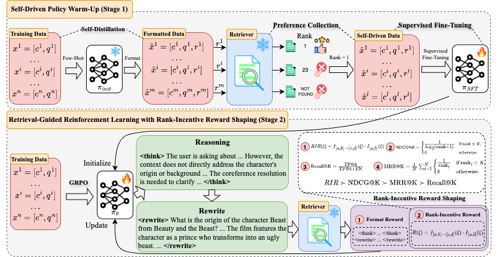

# 📖 ConvSearch-R1
ConvSearch-R1 is a two-stage alignment framework designed for conversational search, with a focus on **conversational query reformulation (CQR)**. To the best of our knowledge, ConvSearch-R1 is the first method to perform the CQR task **without any external supervised data (reference rewrite)**, achieving **SOTA** performance on the TopiOCQA and QReCC datasets. [[arXiv](https://arxiv.org/abs/2505.15776)]




# 📣 News
**[2025/05/10]** Initialize repo.

**[2025/05/21]** Release all code, datasets, and models.

**[2025/05/22]** Publish our paper to arXiv.


# 📌 Release
We have open-sourced the data used for SFT, as well as the final four models.

|Model| From| Dataset | From|
| ---- | ---- | ---- | ---- |
| [Qwen2.5-3B-ConvSearch-R1-TopiOCQA 🤗](https://huggingface.co/BeastyZ/Qwen2.5-3B-ConvSearch-R1-TopiOCQA)| Trained on TopiOCQA using GRPO | [Qwen2.5-3B-SFT-TopiOCQA 🤗](https://huggingface.co/datasets/BeastyZ/Qwen2.5-3B-SFT-TopiOCQA) |Self-distilled from TopiOCQA using Qwen2.5-3B|
| [Qwen2.5-3B-ConvSearch-R1-QReCC 🤗](https://huggingface.co/BeastyZ/Qwen2.5-3B-ConvSearch-R1-QReCC) | Trained on QReCC using GRPO | [Qwen2.5-3B-SFT-QReCC 🤗](https://huggingface.co/datasets/BeastyZ/Qwen2.5-3B-SFT-QReCC) | Self-distilled from QReCC using Qwen2.5-3B |
| [Llama3.2-3B-ConvSearch-R1-TopiOCQA🤗](https://huggingface.co/BeastyZ/Llama3.2-3B-ConvSearch-R1-TopiOCQA)|  Trained on TopiOCQA using GRPO | [Llama3.2-3B-SFT-TopiOCQA 🤗](https://huggingface.co/datasets/BeastyZ/Llama3.2-3B-SFT-TopiOCQA) | Self-distilled from TopiOCQA using Llama3.2-3B |
| [ Llama3.2-3B-ConvSearch-R1-QReCC 🤗](https://huggingface.co/BeastyZ/Llama3.2-3B-ConvSearch-R1-QReCC) | Trained on QReCC using GRPO | [Llama3.2-3B-SFT-QReCC 🤗](https://huggingface.co/datasets/BeastyZ/Llama3.2-3B-SFT-QReCC) |Self-distilled from QReCC using Llama3.2-3B|


# 🛠️ Installation
Since training process involves retrieval and RL, to avoid interference between environments, retrieval and RL use their own separate environments.

Setup for retrieval
```bash
git clone https://github.com/BeastyZ/ConvSearch-R1.git
cd ConvSearch-R1

conda create -n retriever python=3.10
conda activate retriever

pip3 install -r requirements_retriever.txt
```

Setup for RL using verl
```bash
conda create -n verl python=3.9
conda create verl

pip3 install torch==2.4.0 --index-url https://download.pytorch.org/whl/cu124
pip3 install flash-attn --no-build-isolation

cd verl
pip3 install -e .
```

# 🔥 Training
Verl only supports data in **Parquet** format, and both the data for SFT and GRPO must follow this format.

For the code to preprocess the SFT and GRPO data, please refer to directory [data_preprocess](./verl/examples/data_preprocess).

## SFT
For more examples about SFT, see [SFT](./verl/examples/sft).
```bash
conda activate verl

set -x

nproc_per_node=8
save_path=ckpt/sft/qrecc/llama3.2-3b-it_self
export WANDB_API_KEY="your_wandb_key"
HOME=path/to/your/work/home

torchrun --standalone --nnodes=1 --nproc_per_node=$nproc_per_node \
     -m verl.trainer.fsdp_sft_trainer \
    data.train_files=$HOME/data/qrecc/sft/train_llama3.2-3b-it_self.parquet \
    data.val_files=$HOME/data/qrecc/sft/test_llama3.2-3b-it_self.parquet \
    data.prompt_key=extra_info \
    data.response_key=extra_info \
    +data.prompt_dict_keys=['prompt'] \
    +data.response_dict_keys=['answer'] \
    data.train_batch_size=64 \
    data.micro_batch_size_per_gpu=8 \
    data.max_length=3072 \
    data.truncation=right \
    model.partial_pretrain=path/to/your/model \
    model.enable_gradient_checkpointing=True \
    trainer.default_local_dir=$save_path \
    trainer.project_name=llama3.2-3b-it_qrecc-sft \
    trainer.experiment_name=llama3.2-3b-it_self_epoch2 \
    trainer.total_epochs=2 \
    trainer.logger=['wandb'] \
    trainer.default_hdfs_dir=null
```
## GRPO
For more examples about GRPO, see [GRPO](./verl/examples/grpo_trainer).
```bash
conda activate verl

#!/bin/bash
set -x

export CUDA_VISIBLE_DEVICES=0,1,2,3,4,5,6,7
export VLLM_ATTENTION_BACKEND=XFORMERS
export WANDB_API_KEY="your_wandb_key"
DATE=$(date "+%y%m%d%H%M")
HOME=path/to/your/work/home

PROJECT_NAME=verl_grpo_rewrite_qrecc
EXPERIMENT_NAME=llama3.2_3b_it_self_bs128_maxlen1024_lr1e-6_warmup100_n8_temp0.7_epoch9_r9_v3
export RETRIEVER_URL="your_retrieval_server_url"


python3 -m verl.trainer.main_ppo \
    algorithm.adv_estimator=grpo \
    data.train_files=$HOME/data/qrecc/train_v3.parquet \
    data.val_files=$HOME/data/qrecc/test_v3.parquet \
    data.train_batch_size=128 \
    data.max_prompt_length=1536 \
    data.max_response_length=1024 \
    data.filter_overlong_prompts=True \
    data.truncation='error' \
    actor_rollout_ref.model.path=path/to/your/sft/model \
    actor_rollout_ref.actor.optim.lr=1e-6 \
    actor_rollout_ref.actor.optim.lr_warmup_steps=100 \
    actor_rollout_ref.model.use_remove_padding=True \
    actor_rollout_ref.actor.ppo_mini_batch_size=128 \
    actor_rollout_ref.actor.ppo_micro_batch_size_per_gpu=8 \
    actor_rollout_ref.actor.use_kl_loss=True \
    actor_rollout_ref.actor.kl_loss_coef=0.001 \
    actor_rollout_ref.actor.kl_loss_type=low_var_kl \
    actor_rollout_ref.model.enable_gradient_checkpointing=True \
    actor_rollout_ref.actor.fsdp_config.param_offload=False \
    actor_rollout_ref.actor.fsdp_config.optimizer_offload=False \
    actor_rollout_ref.rollout.log_prob_micro_batch_size_per_gpu=32 \
    actor_rollout_ref.rollout.tensor_model_parallel_size=1 \
    actor_rollout_ref.rollout.name=vllm \
    actor_rollout_ref.rollout.gpu_memory_utilization=0.6 \
    actor_rollout_ref.rollout.n=8 \
    actor_rollout_ref.rollout.temperature=0.7 \
    actor_rollout_ref.ref.log_prob_micro_batch_size_per_gpu=32 \
    actor_rollout_ref.ref.fsdp_config.param_offload=True \
    algorithm.kl_ctrl.kl_coef=0.001 \
    trainer.critic_warmup=0 \
    trainer.logger=['wandb'] \
    trainer.project_name=$PROJECT_NAME \
    trainer.experiment_name=$EXPERIMENT_NAME \
    trainer.n_gpus_per_node=8 \
    trainer.nnodes=1 \
    trainer.save_freq=100 \
    trainer.test_freq=-1 \
    trainer.default_local_dir=ckpt/qrecc/dense/$EXPERIMENT_NAME \
    trainer.total_epochs=9 \
    reward_model.reward_manager=rewrite_r1 \
    custom_reward_function.path=verl/verl/utils/reward_score/rewrite_r1.py \
    retriever.topk=100 $@ 2>&1 | tee logs/${DATE}_${EXPERIMENT_NAME}.log
```

# 🤖 Inference
We need to collect data for evaluation. For more examples about inference, see [infer](./src/infer).
```bash
conda activate verl

python3 src/infer/infer.py \
    --model_name_or_path path/to/your/model \
    --model_name ConvSearch-R1 \
    --dp_size 8 \
    --gpus_per_dp_rank 1 \
    --temperature 0.7 \
    --input_path data/topiocqa/dev.json \
    --output_path path/to/your/output
```

# 👨‍⚖️ Evaluation
For more details about evaluation, see [eval](./src/eval).
```bash
conda activate retriever

python3 src/eval/get_metrics_using_ance.py \
    --pretrained_encoder_path path/to/your/dense/retriever \
    --test_file_path path/to/rewrite/file/gennerated/by/rewriter \
    --passage_embeddings_dir_path "embedding/ance_topiocqa" \
    --qrel_output_dir data/topiocqa/qrel/dense \
    --output_trec_file filename/to/save/trec/file \
    --trec_gold_qrel_file_path data/topiocqa/dev.trec \
    --n_gpu 2 \
    --test_type rewrite
```

# 🙏 Acknowledgement
We use verl for SFT and GRPO: https://github.com/volcengine/verl


# 👋 Citation
```
@misc{zhu2025convsearchr1enhancingqueryreformulation,
      title={ConvSearch-R1: Enhancing Query Reformulation for Conversational Search with Reasoning via Reinforcement Learning}, 
      author={Changtai Zhu and Siyin Wang and Ruijun Feng and Kai Song and Xipeng Qiu},
      year={2025},
      eprint={2505.15776},
      archivePrefix={arXiv},
      primaryClass={cs.CL},
      url={https://arxiv.org/abs/2505.15776}, 
}
```
